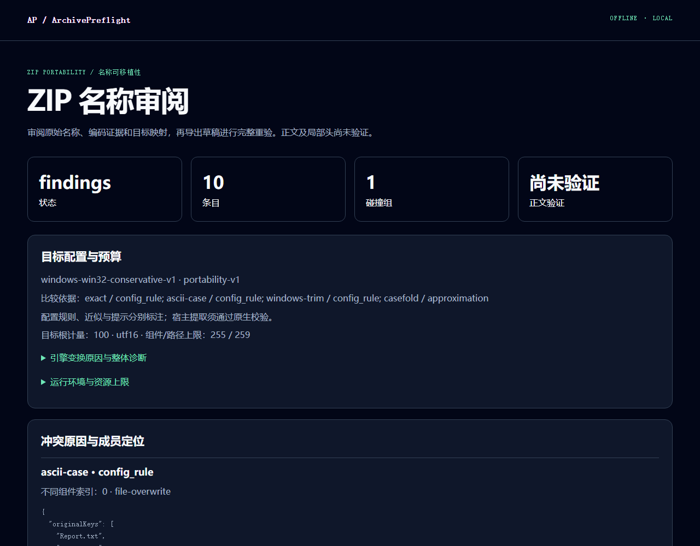

# ArchivePreflight

### 解压之前，先审阅 ZIP 名称

[English](README.md) · 简体中文

[开始使用](#从演示开始) · [配置与宿主](#配置与宿主范围) · [开发与构建](#开发与构建)

ArchivePreflight 在解压前审阅 ZIP 文件名：保留原始字节和编码候选，解释 Windows、macOS、Linux 配置下的名称碰撞，生成可编辑的离线报告。明确接受完整重验后的计划，即可向新建的原生受控目录进行受限验证提取。



实际演示截图：查看原始字节证据，编辑命名草稿。

**English summary: inspect ZIP filename bytes and encoding candidates, review platform collisions, and validate a naming plan for bounded extraction.**

## 从演示开始

运行环境为 Python 3.12 及以上，核心只使用标准库，运行依赖为零：

```sh
python -m pip install .
archive-preflight demo --output demo-output
```

打开 `demo-output/report.html`，搜索条目、查看字节与候选证据、编辑 keep/rename/skip 并导出草稿。演示包含大小写碰撞、保留名、尾点、NFC/NFD、深路径预算、父目录跳转、Unix 链接和高声明压缩比八类风险；四份配置 JSON 展示规则差异。发现风险时退出码 1 是正常结果。

自己的 ZIP 可沿以下流程操作：

```sh
mkdir .archive-preflight-local
archive-preflight inspect sample.zip --target windows --target-root X:/delivery --html .archive-preflight-local/report.html --report-json .archive-preflight-local/report.json --plan .archive-preflight-local/draft.json
archive-preflight validate-plan sample.zip --mapping .archive-preflight-local/reviewed-draft.json --output .archive-preflight-local/validated.json
archive-preflight extract sample.zip --plan .archive-preflight-local/validated.json --accept-plan PLAN_ID_FROM_VALIDATED_JSON --output .archive-preflight-local/new-output --result-json .archive-preflight-local/result.json
```

打开 `.archive-preflight-local/report.html`，将导出的草稿保存为 `.archive-preflight-local/reviewed-draft.json`。将占位符替换为当前 validated JSON 的 `planId`。假设目标根只保留计量长度；名称解释与深路径预算仍有诊断时，先审阅修改。HTML 只导出 **draft 草稿**，每次改名或选择编码后都要重新运行 `validate-plan`。浏览器不复制平台规则，也不执行提取。

`extract --seconds 0.5` 可降低整个提取请求的墙钟预算；默认 60 秒，只接受有限、严格大于 0 且不超过 60 的数值。报告和输出目录必须是新路径，结果 JSON 放在提取树外。`--json` 的 stdout 只有严格 JSON，诊断走 stderr。退出码：0 完整无风险或 verified，1 发现风险，2 输入无效，3 不完整／不支持／限额／变化，4 提取失败；verified 摘要仍列跳过数。

## 配置与宿主范围

| 配置 | 比较含义 |
| --- | --- |
| `windows-win32-conservative-v1` / `windows` | 保守 Win32 名称及 UTF-16 预算，casefold 标记为近似 |
| `macos-apfs-ci-advisory-v1` / `macos` | 大小写不敏感交付规则，归一化与 casefold 标记为近似 |
| `macos-apfs-cs-advisory-v1` | 大小写敏感交付规则，归一化标记为近似 |
| `linux-posix-bytes-v1` / `linux` | 精确 UTF-8 字节交付规则，归一化／casefold 只提示 |

报告记录配置版本和 Python／Unicode／zlib 版本。配置规则与原生 NTFS／APFS 比较表、Linux 特定挂载行为分别对待。Windows 本地 NTFS 有源码 CLI 与原生句柄实测；独立 exe 的真实验收见[支持矩阵](docs/SUPPORT.md)。Linux／macOS 原生提取仍等待对应宿主／CI 实际执行；网络路径及 reparse 祖先受控拒绝。

## 离线证据与提取边界

预检读取有界中央目录与必要的 EOCD／ZIP64 尾窗口，不读取成员流、解压正文或计算正文 hash。短 ZIP 的必要尾搜索窗口可能物理重叠压缩字节。`archiveId` 绑定元数据；提取另核验 local、完整 STORED／raw DEFLATE、真实大小、CRC 和输出 SHA-256。

单文件 HTML 内联资源，CSP 限制网络，采用可见控制／双向字符转义，无服务器、遥测和 CDN。报告包含原始名称证据，分享前请本地审阅；绝对本地根、ZIP comment 与正文不进入报告。

提取仅支持方法 0／8 的普通文件和目录，输出必须不存在；不覆盖、不创建链接、不复制权限或文件元数据。上限为文件／目录各 10,000、单文件 256 MiB、总量 1 GiB、60 秒；预检包 8 GiB、中央目录 16 MiB、条目 50,000。受控失败只清理已验证归属的对象；强杀时保留未知归属树，实际数量为 null／未知。按现场指定位置检查后再手工处理。

威胁模型覆盖不可信 ZIP 引发的自动逃逸、覆盖和资源扩张。管理员或恶意同账号修改可信父目录／源文件、恶意软件检查与来源认证需要独立措施。

## 开发与构建

```sh
python -m unittest discover -v
python fixtures/build_fixtures.py --output fixtures/generated
python -m pip install --require-hashes -r requirements-build.txt
python scripts/build_windows.py
```

源码仓库保留 18 个合成 ZIP 样本的生成器与独立验收事实；用上方命令在本地生成样本。

Windows x64 使用 PyInstaller 6.22.3 及带 hash 的精确开发锁，独立 exe 内含 Python 和离线资源。源码 wheel 运行依赖为零；Git 忽略 `build/`、`dist/`、`demo-output/` 和私有工作流目录 `.archive-preflight-local/`，并保护 `.env`／`.env.*`，仅允许共享模板 `.env.example` 例外。保存在其他位置的报告仍需在暂存前审阅。浏览器验证用 Playwright 1.58.2：`npm ci`、`npx playwright install firefox`，再运行 `node tests/report.browser.cjs REPORT_HTML EVIDENCE_DIRECTORY INJECTION_HTML`。CI 配方必须实际运行后才计为宿主证据。

原创代码采用 MIT，版权署名 cloudwallker；exe 中第三方组件遵循各自许可，见[第三方许可](THIRD_PARTY_NOTICES.md)。[更新记录](CHANGELOG.md) · [贡献说明](CONTRIBUTING.md)。采用访谈与跨平台解压器对照属于研究工作，支持矩阵区分实际观察和未验证平台。
